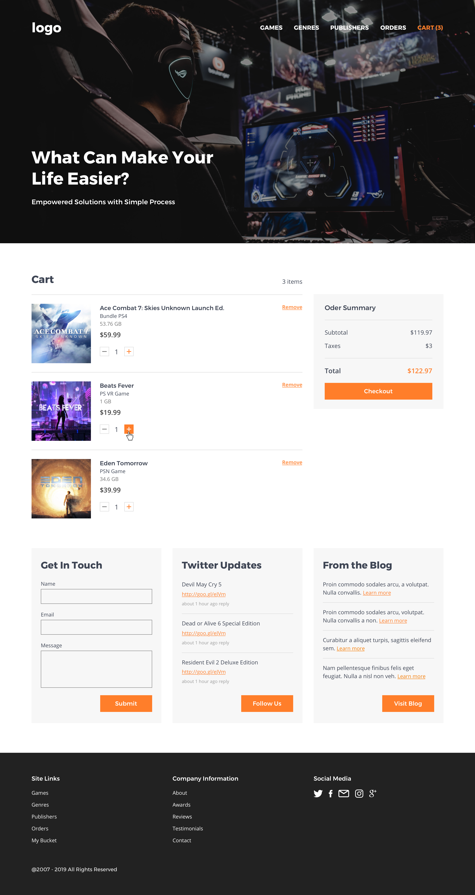

## FullStack GameStore — Backend + Angular UI

Modern Game Admin Panel with ASP.NET Core 6 (Web API + MVC), Entity Framework Core, SQL Server, and an Angular frontend.



### Overview
GameStore is a full-stack learning-grade application demonstrating production-style patterns: clean layered architecture, role/permission-based authorization, rich CRUD flows, server-side validation, API documentation, automated mapping, and an Angular UI with client-side routing and localization hooks.

### Tech stack
- Backend: C#, ASP.NET Core 6, EF Core, Swagger/OpenAPI, AutoMapper, xUnit, StyleCop
- Database: SQL Server (local), EF Core Migrations
- Frontend: Angular 20, RxJS
- AuthZ: Custom permission- and role-based authorization with policy provider/handlers
- Observability: Centralized exception handling, request logging middleware
- Tooling: .NET CLI, Node.js/NPM

### Key features
- Authorization and RBAC
  - Permissions and roles with custom policy provider and authorization handlers
  - Attributes for permission/role requirements on controllers/actions
- CRUD and business flows
  - Full CRUD for Games, Genres, Platforms, Publishers, Orders, Comments
  - Validation at entity and DTO levels; comprehensive controller/service tests
  - Pagination, filtering, projection via DTOs and AutoMapper
- Localization (i18n-ready)
  - `GameLocalizationEntity` and related services/seeders for multi-language game data
  - Frontend translation utilities and configuration-driven UI strings
- API documentation
  - Swagger/OpenAPI with discoverable endpoints and schemas
- Clean architecture and maintainability
  - Clear layering (Entities → DAL → BLL → Web), SOLID principles, StyleCop rules
- Frontend UI
  - Angular SPA with routing, feature components, and services consuming the API

### Architecture
- Layered solution designed for modularity and future service extraction:
  - `Entity`: Persistence-agnostic domain models
  - `Dal`: EF Core DbContext, repositories, migrations, seeders
  - `Bll`: Business services, DTOs, mapping profiles
  - `Web`: ASP.NET Core (Web API + MVC), middleware, authorization, hosting
  - `Tests`: xUnit test projects for entities, middleware, controllers, and services
  - `gamestore-ui-app`: Angular application consuming the backend

Note: While the current deployment is a layered monolith, boundaries are structured to support gradual extraction to microservices if desired.

### Solution layout
- `AdminPanel.Entity` — domain/entities
- `AdminPanel.Dal` — EF Core DbContext, migrations, repositories, seeders
- `AdminPanel.Bll` — services, DTOs, mapping
- `AdminPanel.Web` — ASP.NET Core Web (API + MVC), middleware, auth, Swagger
- `AdminPanel.Tests` — unit/integration tests (xUnit)
- `gamestore-ui-app` — Angular UI consuming the backend APIs

### Prerequisites
- .NET 6 SDK
- SQL Server (Developer/Express/local)
- Node.js 20+ and npm

### Backend — local setup
1) Configure database connection (optional)
   - Edit `AdminPanel.Web/appsettings.Development.json` → `ConnectionStrings:DefaultConnection` for your SQL Server.

2) Restore and build
```bash
dotnet build Gamestore.sln -c Debug
```

3) Apply migrations (creates/updates the DB)
```bash
dotnet ef database update --project AdminPanel.Dal --startup-project AdminPanel.Web
```

4) Run the backend (Swagger enabled)
```bash
dotnet run --project AdminPanel.Web/AdminPanel.Web.csproj -c Debug
```
- Swagger UI: http://localhost:5000/swagger or the port shown in console

### Frontend — local setup
```bash
cd gamestore-ui-app
npm install
npm run start
```
- Angular dev server: http://localhost:4200

### Testing
```bash
dotnet test AdminPanel.Tests/AdminPanel.Tests.csproj -c Debug
```

### Useful commands
```bash
# Build everything
dotnet build Gamestore.sln -c Debug

# Run only the API/Web project
dotnet run --project AdminPanel.Web/AdminPanel.Web.csproj -c Debug

# Create a new migration (example)
dotnet ef migrations add <Name> --project AdminPanel.Dal --startup-project AdminPanel.Web
```

### Notes
- Role/permission-based authorization and middleware for error handling/logging are configured in `AdminPanel.Web/Authorization` and `AdminPanel.Web/Middleware`.
- DTO mapping is centralized via AutoMapper in `AdminPanel.Bll/Mapping`.
- The Angular app consumes the published API endpoints from the backend.


